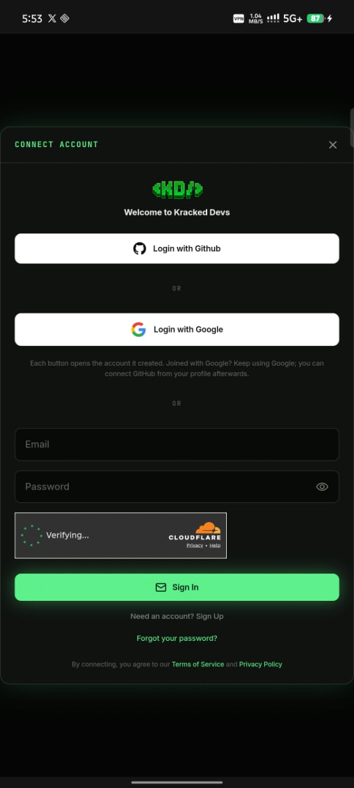
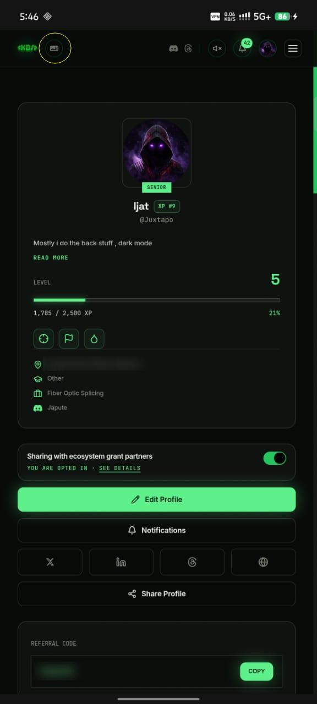
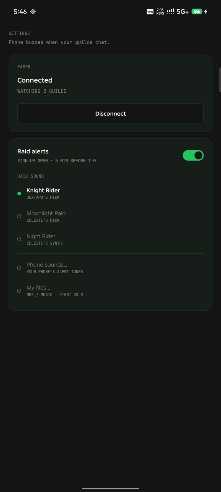

# KD Pager

<p align="center"></p>

**An Android app for [Kracked Devs](https://krackeddevs.com) with real push notifications built in** — guild chat pings with the sender's face, and raid alerts with the boss on your lock screen.

> Unofficial community project. Not made by or affiliated with Kracked Devs. The app shows KD's own website; login happens on KD's own page.

<p align="center">
  
  
  
</p>

## What it does

- **KD, as an app** — opens on your dashboard (`/dashboard/profile`). Everything you see is KD's own site.
- **Guild chat notifications** — a message in any guild you're in buzzes your phone, even when the app is closed. Shows `@sender · Guild` and the sender's KD avatar. `@yourname` mentions get their own louder channel.
- **Raid alerts** — a ping when raid sign-up opens and another **5 minutes before T-0**. The boss's portrait is on the notification, with **Join raid** / **Not this time** buttons.
- **Raid sound** — *Old Vibe* (Juxtapo's pick, the default), *Moonlight Raid* and *Night Rider* (original, synthesised in `sounds/synth.py`), any of your phone's tones, or **your own mp3** (first 25 s, faded out).
- **Pager settings** live behind the pager button next to the `<KD/>` logo.

## Getting started

1. Install the APK from [Releases](../../releases/latest) — what changed in each version: [CHANGELOG](CHANGELOG.md) (Android 8+; own sound files need Android 10+).
2. Log in to KD — use **GitHub, Discord or email**. Google blocks its login inside apps.
3. Allow notifications when asked. The pager switches on by itself — one login, that's it.
4. The pager button next to `<KD/>` shows a dot: **green** = pager on, **grey** = off. Tap it for settings (**Pager on/off**, **Log out**).

**One login.** KD's login (Supabase) rotates its refresh token on every refresh and treats an old one coming back as theft, so two refreshers sharing one session would log each other out. KD Pager makes the hub the only refresher: after you log in, the app hands its session to the hub, and the app asks the hub for a fresh access token whenever KD's page needs one. Your phone keeps an access token only.

Slow mobile data makes the KD login pages feel laggy; first login on Wi-Fi is smoothest.

## What the pager stores (and doesn't)

| | |
|---|---|
| Your password | **Never seen.** Login happens on KD's own page. |
| Your KD session | Held **encrypted** on the hub — the only copy of the refresh token. Used to listen to the guild chats you're already in and to hand your phone fresh access tokens. Access tokens never touch disk. |
| Messages | Relayed to your phone, **not stored**. |
| Pager off / Log out | Removes your phone from the hub immediately. Max 3 phones per account. |

## How it works

```
KD (Supabase realtime) ──► hub (Rust, one small VM) ──► Firebase Cloud Messaging ──► your phone
                               ▲                                                      │
                               └────── one login, handed over; fresh access tokens ───┘
```

- **Hub** (`hub/`): holds each connected user's pager session, keeps one realtime socket per guild, resolves sender names/avatars from the guild Members page, and reads the public `/raid` page every 30 min for raid times and the boss sprite.
- **App** (`android/`): Kotlin, no frameworks — a WebView for KD, a native settings page in KD's palette (JetBrains Mono, OFL), FCM for delivery so aggressive battery savers can't kill it.
- **Security**: each phone proves it owns its registration with a per-device key. Found a security problem? Please report it privately (GitHub → Security → *Report a vulnerability*), not as a public issue.

## Build from source

**App** — needs your own Firebase project:

```bash
cp /path/to/your/google-services.json android/app/      # Firebase console → Android app com.juxtapo.kdpager
cd android && ./gradlew assembleDebug                    # dev build (debuggable — don't hand it out)
# release: create android/keystore.properties (storeFile, storePassword, keyAlias, keyPassword), then
./gradlew assembleRelease
```

**Hub** — Rust, see [`hub/README.md`](hub/README.md). Build on (or for) the target distro — the binary links glibc dynamically:

```bash
cd hub && cargo test && cargo build --release
```

Point the app at your hub by changing `Hub.BASE` in `android/app/src/main/java/com/juxtapo/kdpager/Hub.kt`.

## Credits

Built by **Juxtapo** with **Celeste** (Claude). Raid sounds *Moonlight Raid* and *Night Rider* are original, synthesised from scratch. *Old Vibe* ships in the release APK only. JetBrains Mono © The JetBrains Mono Project Authors, SIL OFL 1.1 (`android/FONT-LICENSE-JetBrainsMono.txt`).

## License

MIT — see [LICENSE](LICENSE).
